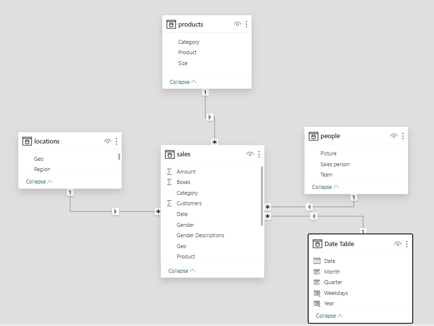
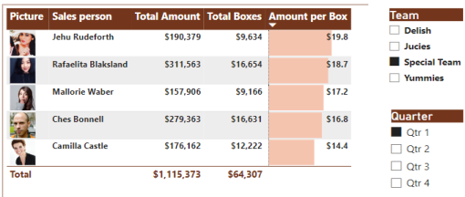
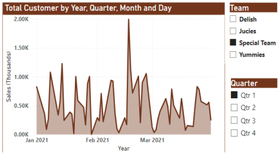
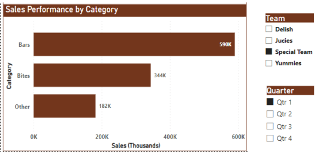
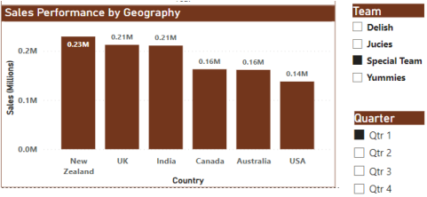
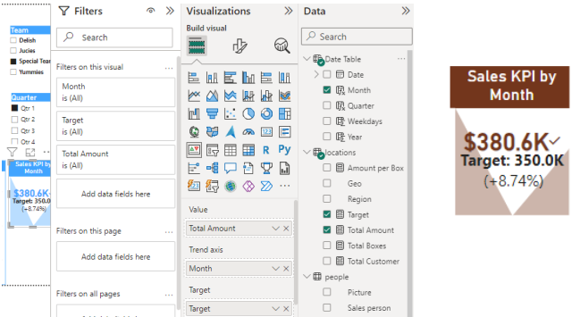
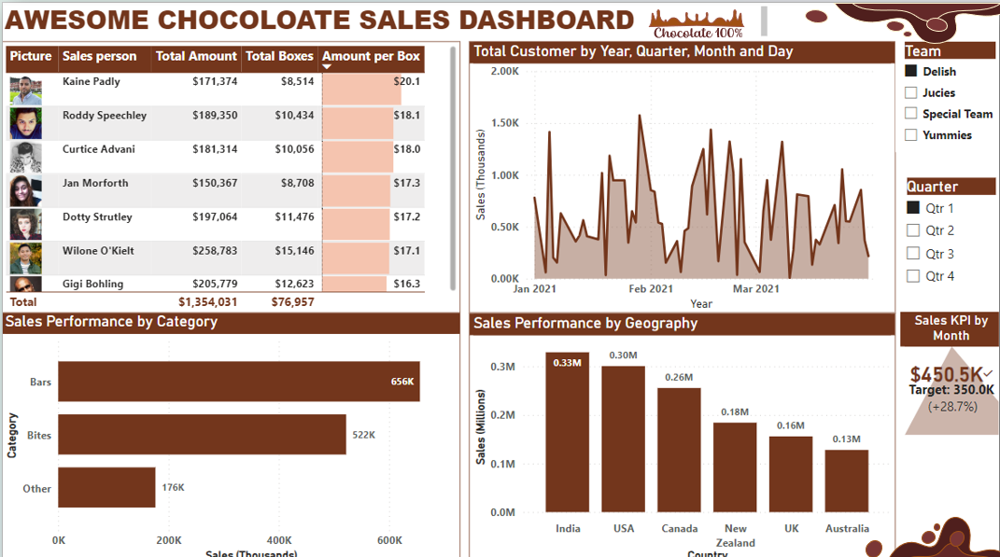
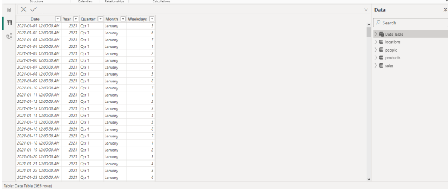

# Chocolate-Sales-Analysis-Power-BI

  

## Introduction
The multinational organization sales performance analysis project aims to evaluate the sales performance of the teams serving different regions and the organization as a whole. The project involves collecting and analyzing sales data from various regions or branches of the organization. Through data exploration, statistical analysis, and visualization techniques, the project seeks to identify trends, patterns, and insights in sales performance.

The project involves collecting and analyzing sales data from various regions or branches of the organization. Through data exploration, statistical analysis, and visualization techniques, the project seeks to identify trends, patterns, and insights in sales performance. Using Power Query for data cleansing, and Power BI for analysis and visuals.

In our analysis using Power BI, we have decided to go with different graphs in our dashboard as compared to the graphs we are using Tableau which indicates Salespeople performance, Total Customers by Year, Quarter, Month, Sales Performance by Category, and Sales Performance by Geography which can be filtered according to Team, Quarter. We also managed to fit the Sales KPI for each team or person included in a team according to quarters, which helps us evaluate a team or individual performance over the year whether they have underperformed neutrally or overachieved the goals that were set. 

**Connect to the dataset here: [Download](sales_dataset.xlsx)**
Connect to the dashboard [here](https://app.powerbi.com/groups/me/reports/cd340adf-15b1-4314-9b66-eb399f1b71ed/ReportSection?experience=power-bi)

For analysis purposes, I will be using the Special Team for Q1 as our filters for references during the entire explanation.

## Data Modelling
In a relational database schema, such as a data warehousing system, the fact table and dimension tables are key components used in a dimensional modelling technique, often associated with the star or snowflake schema. Based on the fact that this project has the main table (fact table) and other related information, we'll be using the Star Schema where all other tables are connected to the main table (fact table).

  
Fig 1: Data Modelling

While fact tables contain the quantitative data or measures of interest, dimension tables provide the context and descriptive attributes necessary for analysis and reporting. Together, they form the foundation of a multidimensional data model, enabling businesses to perform complex analyses, generate insights, and make informed decisions based on their data.

## Problem Statement
The following are what we intend to build to build the project:
* Sales by Team (Salespeople) – Table Chart 
* Customer Growth (Team base) – Area Chart
* Sales by Category Overall – Horizontal Bar Chart
* Overall Sales by Quarter – Vertical Bar Chart
* Overall Sales Target – Score Card

## Key Skills Demonstration
* Filtering and Slicing
* Build a KPI to track team performance and target
* Develop a Date Table to have control of the date analysis of our date
* Incorporate performance horizontal smart bar into the Sales Rating table
* Incorporate Salespeople image into the Sales Rating table
* Using the DAX to develop various measures
* Build a Dashboard

## Analysis and Report of findings

1. **Salespeople Performance Overview:**
Examining sales performance indicators for teams or individual salespeople. Metrics can include overall sales income, the number of new clients attracted, the accomplishment of sales goals, etc. Makes it possible to compare several salespeople or teams to pinpoint high achievers and areas in need of development.

Fig 2: Salespeople Performance

This analysis sheds light on the contributing elements. Considering the data on salespeople's
performances that was supplied:

**Camilla Castle:** In terms of overall sales volume and efficiency in turning sales into boxes, Camilla Castle appears to be the top-performing salesperson with the largest total amount of $1,115,373 and a pretty high average amount per box ($17.3). Among all salespeople, she generated the most total income, making her performance noteworthy.

**Rafaelita Blaksland:** With an average amount per box of $18.7, Rafaelita Blaksland achieved a total amount of $311,563. Although her overall sales volume is less than Camilla Castle's, she has a higher average value per box, suggesting that she might be effective at upselling or selling more expensive things.

**Jehu Rudeforth:** Jehu Rudeforth's performance brought in $190,379 in total, with an average of $19.8 per box. Despite having the lowest overall sales volume of all the salespeople listed, he achieved the highest average amount per box by recommending sensible sales techniques or emphasizing high-end goods.

**Mallorie Waber:** With an average amount per box of $17.2, Mallorie Waber was able to attain a total of $157,906 in earnings. Her average amount per box is comparable with the overall average, but has a lower total sales volume than other salespeople, suggesting a balanced performance.

**Ches Bonnell:** With an average of $14.4 per box, Ches Bonnell was able to attain a total of $176,162. His average amount per box is comparatively lower than others, despite his total sales volume being comparable. This suggests that there may be room for improvement in terms of sales efficiency or product mix optimization.

All things considered, Camilla Castle is the best performer in terms of overall sales volume, and Jehu Rudeforth is quite effective at making money per box. To improve the performance of the sales force, strategies for resource allocation, product marketing, and sales training can be informed by the insights gained from these performances.

2. **Total Customer by Year, Quarter, Month:**
This analysis sheds light on the variables influencing variations in the overall number of customers along various dimensions, including product, category, salesperson, gender, location, size, and region.

  
Fig 3: Customer Growth Trend

Comprehending these patterns can aid in making strategic choices and allocating resources to maximize fforts towards acquiring and retaining customers.

**Below is a summary of the analysis that was done:**

**The overall number of clients** increased by 18.21% in Qtr 1 of 2021 between January and February.

**Products like** "After Nines," "50% Dark Bites," and "Smooth Silky Salty" were the main causes of the rise in overall customer count, whereas "Baker's Choco Chips" had a decline in client base.

**Total Clients Broken Down by Category:**  -- The 'Bites' category was the main driver of the overall customer gain, counterbalancing the decline in the 'Bars' category.

**Total Clientele by Sales Representative:** -- Camilla Castle contributed the most to the increase in total customers among salespersons, while there was a decrease in customers associated with Ches Bonnell. The relative contributions of salespersons shifted accordingly.

**Total Clientele Broken Down by Gender:** -- The gender category with the highest percentage of clients was found to be female, offsetting a decline in the male category.

**Total Clients by Region (Geo):** -- * The UK saw a decline in overall clients, whilst Canada and Australia were the primary drivers of the increase. There were notable shifts in the proportional contributions of various geographical areas.

**Total Clientele Broken Down by Size:** -- The 'Small' size category was mostly linked to the increase in total customers.

**Total Clientele by Area:** -- The 'Americas' region was the main driver of the gain in overall consumers, countering a decline in the 'Europe' region. The greatest shift was observed in the 'Americas' region's relative contribution.

3. **Sales by Category:**
These insights draw attention to the various aspects that affect the distribution of sales by category, such as gender preferences, individual sales success, seasonality, geographic location, and product size. To enhance category sales and overall revenue, it can be helpful to understand these aspects and improve marketing strategy, product positioning, and sales activities.

  
Fig 4: Sales by Category

**Considering the sales data by category:**

**Size Distribution:** The size of the products has a big impact on how sales are distributed by category. 45.4% of records are for products in the "small" category, while 54.6% are for products in the "large" category. This implies that the product's size is a major factor in influencing the distribution of sales overall.  

**Month Impact:** The month has an impact on how sales are distributed by category as well. The distribution is largely affected by the months of January, February, and March, which account for 34.4%, 36.6%, and 29% of the total data, respectively. This indicates seasonal variations or specific marketing campaigns that drive sales during these months.

**Geographical Influence:** The distribution of sales by category is greatly influenced by geographical location, especially in countries like India, the UK, and the USA. 16.9% of recordings are from India, 19.1% are from the UK, and 13.1% are from the USA. This implies that tastes for different product categories vary across different areas.

**Salesperson Contribution:** Each salesperson's performance has an impact on the sales distribution bycategory. Jehu Rudeforth, Camilla Castle, and Mallorie Waber are highlighted as key contributors, with their records impacting the distribution significantly. This emphasizes how crucial individual performance, and successful sales tactics are to boost category sales.

**Regional Factors:** The distribution of sales by category is significantly influenced by location. The regions that have the biggest effects on the distribution are shown to be Europe, Asia Pacific, and the Americas, with APAC having the largest impact at 54.6% of records. This implies that market dynamics or regional preferences may have an impact on category sales.

**Gender Dynamics:** The gender distribution of sales by category is influenced by the following: 72.7% of records are classified as "Female" and 27.3% as "Male". This suggests preferences that are specific to gender or focused marketing tactics aimed at certain target audiences.

4. **Sales by Geography:**
These findings provide light on the intricate interactions between several variables, such as product categories, gender dynamics, individual sales performance, product variance, seasonal trends, and product size preferences, that affect how sales are distributed geographically. Gaining an understanding of these variables can assist in customizing sales efforts, product offers, and marketing tactics to maximize sales performance in various geographic areas.

  
Fig 5: Sales by Geography

**Sales by region Insights:**
Product Category Influence: Product categories have a big impact on how sales are distributed geographically. With 50.8% of the data, "Bars" is the most common category, followed by "Bites" (30.6%) and "Other" (18.6%). This implies that particular product categories are more well-liked or perform better in terms of sales in particular geographic areas.

**Gender Dynamics:** 
Gender plays a crucial role in the distribution of sales by geography, with "Female" accounting for 72.7% of records and "Male" for 27.3% of records. This suggests that gender influences regional differences in sales trends and preferences.Impact of Individual 

**Salespeople:**
The geographic distribution of sales is also greatly influenced by individual salespeople. Notable contributions include _Ches Bonnell, Camilla Castle, and Jehu Rudeforth,_ whose records have a major influence on the distribution. This highlights how crucial
individual performance, and successful sales tactics are to boosting sales in certain geographic areas.

**Product Variance:** Some products significantly affect how sales are distributed geographically. It is indicated that the items "White Choc," "Peanut Butter Cubes," and "Drinking Coco" have the biggest impact on distribution. This implies that tastes for products varies among various geographic locations.

**Influence of Month:** The month has a major impact on how sales are distributed geographically, with March, February, and January having the most effects. This suggests that certain marketing campaigns or seasonal fluctuations are driving sales throughout certain months in various regions.

**Size Preference:** The "Large" and "Small" categories have the biggest influence on how sales are distributed geographically, while other product sizes also have an impact. This implies that preferences for product size may change among various geographic locations.

**Date Impact:** 
Certain dates also have an impact on how purchases are distributed geographically, with certain dates having a more noticeable effect than others. This might be the result of things like sales, occasions, or seasonal patterns that fall on specific dates.

5. **Sales KPI:**
Here we set a target value for each team to reach at the end of each quarter using the measure parameter and DAX equations to estimate the performance of each team.

  
Fig 6: Using KPI to set Target Per team

The Target set was 350K Dollars for the special team for quarter 1 and the achieved value was 380.6K dollars which indicates that the team performed as expected by 8.34% positive note.

  
Fig 7: Final Dashboard

All things considered, using Power BI to examine these variables gives companies useful information they can use to enhance customer satisfaction, better sales tactics, and increase revenue. Through a comprehensive grasp of sales representative performance dynamics, consumer behavior, product inclinations, and geographical variances, enterprises may make well-informed choices that will bolster their competitive edge and propel long-term commercial prosperity.

In POWERBI I also added the **date table** in the model view using the DAX commands which indicate the fact table details, linking the date table with sales and people table forming a entity relationship between them.

   
Fig 8: The Date Table.

In creating the Date table, the following DAX were used:

* Date Table = CALENDARAUTO(): Used to create the date and time for a whole year.
* Year = 'Date Table'[Date].[Year]: This create the year column.
* Quarter = 'Date Table'[Date].[Quarter]: This create the quarter column.
* Month = 'Date Table'[Date].[Month]: This create the month column.
* Weekdays = WEEKDAY('Date Table'[Date],2): This create the weekdays column.

With the above DAX formula, it is easy to reference it, add to the data modelling by linking it to the fact table, and have overall control of our date analysis.

### ON TO THE NEXT... See you soon!
